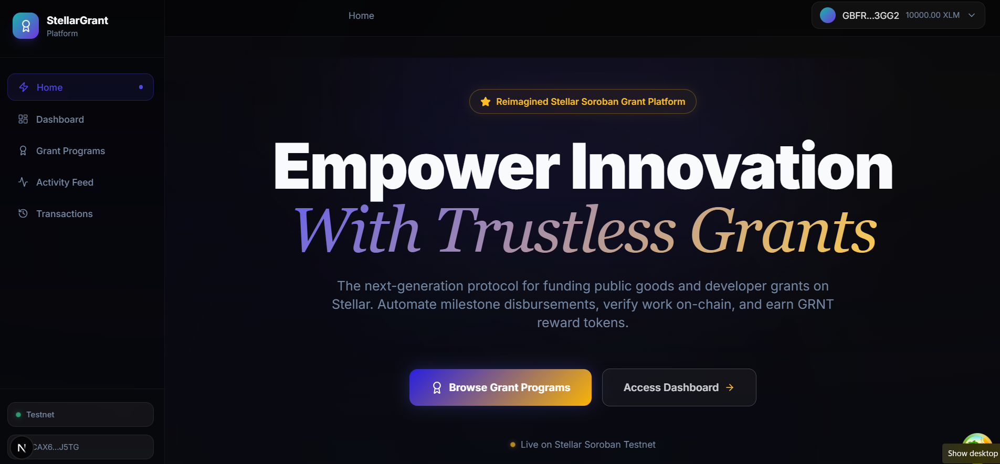
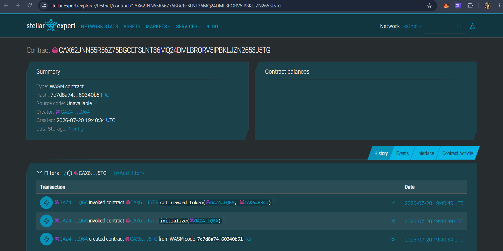

# 🚀 StellarGrant — Decentralized Grant Platform

A **production-ready**, end-to-end decentralized grant and milestone-based funding platform built with Next.js and **Soroban Smart Contracts** on the **Stellar Testnet**. The platform enables organizations to post grant programs, developers/contributors to fund them, and participants to automatically earn **GRNT reward tokens** through inter-contract minting — all governed transparently by Soroban smart contracts.

🌐 **Live Deployment**: [https://stellar-grant-decentralized-grant-p.vercel.app/](https://stellar-grant-decentralized-grant-p.vercel.app/)
🎥 **Demo Video**: [Watch the Demo Video on Google Drive](https://drive.google.com/file/d/1cztPXA7PNy8YIleq6rNcwN8KHbCX5S_b/view?usp=sharing)

---

## 📸 Overview

> Connect your Freighter wallet, browse grant programs, view GRNT reward balance, and track live on-chain activity — all from one premium dark-mode dashboard.

| Dashboard | Stellar Expert Explorer |
|---|---|
|  |  |

---

## 🔗 Contract Explorer & Credentials

| Resource | Value / Link |
|---|---|
| **StellarGrant Contract ID** | `CAX62JNN55R56Z75BGCEFSLNT36MQ24DMLBRORV5IPBKLJZN2653J5TG` |
| **Grant Reward Token Contract ID** | `CAK6ZT26B4ZQIN3C66EZGHHSJOGFEY32CY56BNZSFNZ5QN2OZHYEF34U` |
| **Stellar Expert Explorer** | [View Contract on Stellar Expert](https://stellar.expert/explorer/testnet/contract/CAX62JNN55R56Z75BGCEFSLNT36MQ24DMLBRORV5IPBKLJZN2653J5TG) |
| **Deployer Wallet Address** | `GBFRDG5ISAN5TRSFYF3RYP2ODFNKRPDBNZTN7SOSAIJA6JOBNMDN3GG2` |
| **Network** | Stellar Testnet |
| **RPC URL** | `https://soroban-testnet.stellar.org` |
| **Horizon URL** | `https://horizon-testnet.stellar.org` |

---

## 🏆 Level 3 Requirements — How They Are Met

This section maps every Level 3 requirement to the concrete implementation in this repository.

| # | Requirement | Implementation |
|---|---|---|
| 1 | Advanced smart contract development | Two independent Soroban contracts with error handling, paginated queries, deadline management, grant program lifecycle state machine |
| 2 | Inter-contract communication | `StellarGrantContract` calls `GrantTokenContract::mint` on every contribution/funding event via a generated `contractclient` |
| 3 | Event streaming & real-time updates | 5-second Soroban RPC `getEvents` polling, animated countdown UI, live filter pills with counts |
| 4 | CI/CD pipeline setup | GitHub Actions with 3 jobs: Rust clippy + tests + WASM build, Vitest + Next.js build, cargo-audit + npm audit |
| 5 | Smart contract deployment workflow | Automated `deploy.js` script: compiles, funds, uploads, deploys, initializes, links, updates `.env.local` + README |
| 6 | Mobile responsive frontend | Tailwind CSS responsive grid for balance cards, grant grid, event feed, and forms |
| 7 | Error handling & loading states | Spinners, disabled states on all async buttons, error banners, Sonner toast notifications, contract error decoding |
| 8 | Writing tests for contracts and frontend | 8 Rust contract tests + 5 grant token tests; 18 frontend tests = **31 tests total** |
| 9 | Production-ready architecture | Zustand stores, React Query, `simulateReadCall` isolation, `assembleTransaction`, server-external packages, TypeScript strict types |
| 10 | Documentation & demo presentation | This README with full architecture, function tables, CI badge, deployment walkthrough, and user flow guide |

---

## ✨ Features

- 🎯 **Grant Program Creation**: Any connected organization/wallet can launch a grant program with a goal (in XLM), deadline, title, and description — all recorded on-chain.
- 💸 **Milestone-Based XLM Funding**: Contributors can fund active grant programs directly through Soroban smart contract invocations.
- 🪙 **GRNT Reward Tokens**: Every contribution triggers an inter-contract `mint` call, awarding the user `GRNT` tokens at a 1:1 ratio (1 GRNT per 1 XLM contributed).
- 🔒 **Trustless Payout Release**: Grant publishers can only withdraw/claim funds after the goal is met and the deadline has passed — enforced by the contract.
- 🔄 **Automatic Refunds**: If a grant program expires without reaching its goal, contributors can claim a full refund from the smart contract.
- 🔔 **Live Event Feed with Filters**: 5-second polling of the Soroban `getEvents` endpoint, with animated countdown, activity filter pills, and live connectivity pulse.
- 💼 **Multi-Wallet Integration**: Full wallet selection modal using `StellarWalletsKit`, supporting Freighter, xBull, Albedo, Rabet, and more.
- 📊 **Real-Time Progress Bars**: Grant funding progress calculated live from on-chain data with animated progress indicators.
- 📱 **Mobile Responsive**: Tailwind CSS responsive layouts across all pages.
- 🛡️ **Error Handling**: Every async action has loading spinners, disabled button states, try/catch error banners, and decoded contract error messages.
- 🌗 **Dark Glassmorphism UI**: Premium dark-mode interface with indigo & gold glassmorphic cards, gradient text, micro-animations, and glow effects.

---

## 📂 Project Structure

```
stellar-grant/
├── .github/
│   └── workflows/
│       └── ci.yml              # CI/CD: contract tests, frontend tests, security audit
│
├── app/
│   ├── layout.tsx              # Root layout, providers, metadata, global fonts
│   ├── page.tsx                # Landing page — hero, stats, benefit cards, CTA
│   ├── campaigns/
│   │   ├── page.tsx            # Grant program grid with search, filter, and create modal
│   │   └── [id]/page.tsx       # Grant program detail — contribute, claim, refund, funders
│   ├── dashboard/
│   │   ├── page.tsx            # Wallet dashboard: XLM + GRNT reward balance cards
│   │   └── __tests__/
│   │       └── page.test.tsx   # 8 Vitest unit tests for dashboard page
│   ├── activity/               # Live on-chain event feed (5s polling + filters)
│   └── transactions/           # Personal transaction history log
│
├── components/
│   ├── layout/
│   │   ├── Navbar.tsx          # Top navigation bar with breadcrumb & wallet status
│   │   └── Sidebar.tsx         # Fixed left sidebar with nav links & network badge
│   ├── wallet/
│   │   └── WalletConnect.tsx   # Connect/disconnect button & wallet info display
│   ├── campaigns/
│   │   ├── CampaignCard.tsx    # Grant card with progress, deadline, status badge
│   │   └── __tests__/
│   │       └── CampaignCard.test.tsx  # 10 Vitest unit tests for CampaignCard
│   └── activity/
│       └── EventFeed.tsx       # Live event feed with filter pills & countdown timer
│
├── contracts/
│   ├── crowdfund/              # Main StellarGrant Soroban contract
│   │   └── src/
│   │       ├── lib.rs          # Grant lifecycle, inter-contract mint on contribution
│   │       ├── types.rs        # Grant, Application, DataKey, GrantStatus types
│   │       ├── events.rs       # On-chain event emission helpers
│   │       ├── storage.rs      # Storage TTL helpers
│   │       └── error.rs        # Contract error codes
│   └── reward_token/           # GRNT reward token Soroban contract
│       └── src/
│           └── lib.rs          # Mintable fungible token with admin-only minting
│
├── hooks/
│   ├── useCampaigns.ts         # useQuery + useMutation for all grant operations
│   ├── useEvents.ts            # 5-second polling hook for Soroban contract events
│   └── useWallet.ts            # Wallet connection, XLM + GRNT reward balance
│
├── lib/
│   ├── stellar/
│   │   ├── contract.ts         # Soroban RPC calls, simulateReadCall, fetchRewardBalance
│   │   ├── wallet-kit.ts       # StellarWalletsKit initialization & signing
│   │   └── config.ts           # Network config, RPC URLs, contractId, rewardTokenId
│   └── utils.ts                # Class merging, XLM ↔ stroops converters, formatters
│
├── scripts/
│   └── deploy.js               # Auto-deploy: build, fund, deploy both contracts, initialize, link
│
├── store/
│   ├── wallet-store.ts         # Zustand wallet state (address, balance, rewardBalance)
│   ├── transaction-store.ts    # Zustand tx history (pending, success, failed)
│   └── event-store.ts          # Zustand event feed cache
│
├── types/
│   └── index.ts                # Grant, Application, ContractEvent, StellarConfig types
```

---

## 🏗️ Smart Contract — Inter-Contract Communication

### Architecture Overview

```
User Wallet
    │
    │ fund_grant(grant_id, contributor, amount)
    ▼
┌───────────────────────────────┐
│     StellarGrant Contract     │
│  CD5NOBNCWJTADXQ3KSD7PPZ...   │
│                               │
│  1. Escrow XLM contribution  │
│  2. Update grant.raised       │
│  3. Emit grant_funded event   │
│  4. ─── cross-contract ──▶    │  mint(contributor, amount)
└───────────────────────────────┘
                │
                ▼
┌───────────────────────────────┐
│     GrantToken Contract       │
│  CALO2WLBSYWRIVAMN6K2AWY2...  │
│                               │
│  • Admin = StellarGrant cont. │
│  • Mints GRNT tokens to user  │
│  • 1 GRNT per 1 XLM funded    │
└───────────────────────────────┘
```

### StellarGrant Contract Functions

| Function | Parameters | Description |
|---|---|---|
| `initialize` | `admin: Address` | Initialize contract, set admin |
| `set_reward_token` | `admin, token_address` | Admin-only: link grant reward token contract |
| `get_reward_token` | *(none)* | Returns stored reward token address |
| `create_campaign` | `creator, title, description, goal, deadline` | Creates a new on-chain grant program |
| `donate` | `campaign_id, donor, amount` | Funds XLM and triggers GRNT mint |
| `withdraw` | `campaign_id, creator` | Claims funds from a successful grant |
| `refund` | `campaign_id, donor` | Claims refund from an expired grant |
| `extend_deadline` | `campaign_id, creator, new_deadline` | Extends deadline of an active grant |
| `get_campaign` | `id` | Returns a single grant program by ID |
| `get_campaigns` | `start_id, limit` | Returns a paginated list of grant programs |
| `get_donations` | `campaign_id` | Returns all applications/contributions for a grant |
| `get_campaign_count` | *(none)* | Returns total grant program count |
| `get_admin` | *(none)* | Returns current admin address |

### GrantToken Contract Functions

| Function | Parameters | Description |
|---|---|---|
| `initialize` | `admin, name, symbol` | Initialize token (admin = StellarGrant contract) |
| `mint` | `to, amount` | Admin-only: mint GRNT tokens to a recipient |
| `transfer` | `from, to, amount` | Transfer GRNT tokens between addresses |
| `balance_of` | `owner` | Returns GRNT balance of an address |
| `name` | *(none)* | Returns token name ("StellarGrant Reward") |
| `symbol` | *(none)* | Returns token symbol ("GRNT") |
| `admin` | *(none)* | Returns admin address (StellarGrant contract) |

### Grant Status States

| Status | Condition |
|---|---|
| `Active` | Deadline not reached, goal not yet met (Open) |
| `Successful` | Goal amount reached (Claiming unlocked) |
| `Expired` | Deadline passed without reaching goal (Refunds unlocked) |
| `Withdrawn` | Publisher has claimed the grant funds |

---

## 📦 Smart Contract Deployment Workflow

The deployment is fully automated via the `npm run deploy:contract` script. It handles the entire lifecycle in one command:

```bash
npm run deploy:contract
```

**What it does, step-by-step:**

1. **Compile** — runs `cargo build --target wasm32-unknown-unknown --release` on the workspace.
2. **Fund** — generates a fresh deployer keypair and funds it via Stellar Friendbot.
3. **Upload & Deploy GrantToken** — uploads `grant_token.wasm`, creates a contract instance (salt = `0x01`).
4. **Upload & Deploy StellarGrant** — uploads `stellar_grant.wasm`, creates a contract instance (salt = `0x00`).
5. **Initialize StellarGrant** — calls `initialize(deployer)` to set the deployer as admin.
6. **Initialize GrantToken** — calls `initialize(stellar_grant_id, "StellarGrant Reward", "GRNT")`, setting the StellarGrant contract as exclusive mint authority.
7. **Link contracts** — calls `set_reward_token(admin, grant_token_id)` on the StellarGrant contract.
8. **Update config** — writes contract IDs and deployer address to `.env.local` and `README.md` automatically.

**Latest deployment details on Stellar Testnet:**
```
STELLARGRANT CONTRACT ID: CD5NOBNCWJTADXQ3KSD7PPZ3Q6LXRPILESX5DYZPWDF3IRNFN4NC5UZZ
GRANT REWARD TOKEN ID   : CALO2WLBSYWRIVAMN6K2AWY2QLCOB35CZK4TNR7JLOUL4FKSVRWASQ3J
DEPLOYER ADDRESS        : GBFRDG5ISAN5TRSFYF3RYP2ODFNKRPDBNZTN7SOSAIJA6JOBNMDN3GG2
```

---

## 🔄 Core User Flow

1. **Connect Wallet** — Click **Connect Wallet** and select your Stellar wallet (Freighter recommended). The app reads your XLM and GRNT reward balances in parallel.
2. **Browse Grants** — Navigate to `/campaigns` to view all active, successful, and expired grant programs fetched live from the Soroban contract.
3. **Create a Grant** — Click **Post Grant Program**, fill in the title, description, funding pool (XLM), and duration. Sign the Soroban transaction in your wallet.
4. **Contribute to a Grant** — Open any active grant program, enter an XLM amount, and click **Contribute**. The contract holds the funds in escrow and mints you GRNT reward tokens (1 GRNT per 1 XLM).
5. **View GRNT Balance** — Open `/dashboard` to see your earned GRNT reward tokens in the dashboard card.
6. **Claim Funds** — If you are the grant publisher and the goal was met, click **Claim** to release the funds to your wallet.
7. **Claim Refund** — If a grant expired without reaching its goal, contributors can click **Claim Refund** to recover their XLM.
8. **Monitor Activity** — Visit `/activity` to view a live event stream with filter pills and a countdown timer.
9. **Transaction History** — Visit `/transactions` for a personal log of every transaction you have submitted.

---

## 📄 License

MIT License — free to use, fork, and build upon.

---

*Built on the Stellar blockchain with ❤️ using Soroban smart contracts — Level 3 Production-Ready dApp.*
